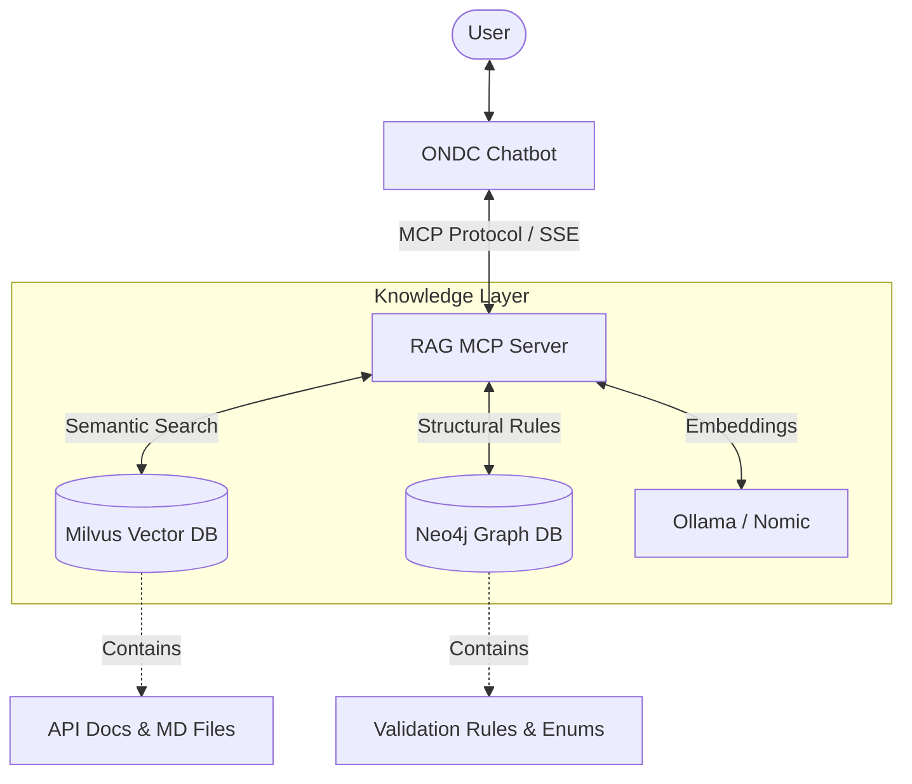

# ONDC Automation RAG MCP Server

[](https://modelcontextprotocol.io/)
[](https://www.python.org/downloads/)
[](https://www.docker.com/)

The **ONDC Automation RAG MCP Server** is a high-performance backend utility designed to bridge the gap between Large Language Models (LLMs) and the complex, multi-layered specifications of the **Open Network for Digital Commerce (ONDC)**.

By implementing the [Model Context Protocol (MCP)](https://modelcontextprotocol.io/), this server allows AI agents (like the ONDC Chatbot) to intelligently query both **Vector** (Milvus) and **Graph** (Neo4j) databases to provide accurate, spec-compliant answers.

---

## 🏗️ Architecture Overview

The server acts as a reasoning layer that combines semantic understanding with deterministic graph traversals.



- **Milvus (Semantic Layer)**: Stores high-dimensional embeddings of ONDC documentation, allowing for "fuzzy" or conceptual searches.
- **Neo4j (Logical Layer)**: Stores the ONDC specification as a knowledge graph, enabling deterministic retrieval of validation rules, session flows, and field relationships.
- **FastMCP (Transport Layer)**: Provides a standardized interface for search tools via Server-Sent Events (SSE).

---

## 🛠️ Tool Catalog

The server exposes the following specialized tools to connected LLM clients:

| Tool | Parameters | Description |
| :--- | :--- | :--- |
| `smart_search` | `query`, `limit`, `domain`, `version`, `action`, `query_from` | **Hybrid Search**: Searches both Milvus and Neo4j simultaneously and merges results. |
| `discover_schema` | `query_from` (milvus/neo4j/all) | **Metadata Discovery**: Lists all available domains, versions, and API actions in the DB. |
| `get_action_rules` | `action`, `domain`, `version`, `skip`, `limit` | **Rule Retrieval**: Finds all validation rules associated with a specific ONDC Action (e.g. `on_search`). |
| `get_field_rules` | `jsonpath`, `domain`, `version`, `skip`, `limit` | **Impact Analysis**: Finds rules affecting a specific JSON path across the spec. |
| `get_session_flow` | *None* | **State Tracing**: Returns the graph of how session tokens and keys move between actions. |
| `get_cross_conflicts` | *None* | **Conflict Detection**: Identifies fields that have conflicting enum definitions across domains. |

---

## 🚀 Getting Started

### 1. Prerequisites
- **Python 3.12+**
- **uv** (Recommended for package management)
- Access to:
  - **Milvus** (Vector DB)
  - **Neo4j** (Graph DB)
  - **Ollama** (Embedding Engine)

### 2. Configuration
Create a `.env` file in the root directory:

```env
# Infrastructure
MILVUS_HOST=localhost
MILVUS_PORT=19530
NEO4J_URI=bolt://localhost:7687
NEO4J_USER=neo4j
NEO4J_PASSWORD=your_password

# AI / Embeddings
OLLAMA_BASE_URL=http://localhost:11434
EMBEDDING_MODEL=nomic-embed-text-v2-moe

# Defaults
DEFAULT_DOMAIN=ONDC:FIS12
DEFAULT_API_VERSION=2.0.2
LOG_LEVEL=INFO
```

### 3. Installation & Run

#### Using `uv` (Local Development)
```bash
# Install dependencies
uv sync

# Run the server
uv run python main.py
```
The server will be available at `http://localhost:8004/sse`.

#### Using Docker
```bash
# Ensure the external network exists
docker network create rag_network || true

# Start the service
docker compose up --build
```

---

## 🔗 Integration with Chatbot

To connect the **ONDC Chatbot** to this server, ensure the chatbot's `MCP_SERVER_URL` is set to point to this server's SSE endpoint:

```env
MCP_SERVER_URL=http://automation-rag-mcp:8004/sse
```

---

## 🛠️ Development & Debugging

- **Logs**: The server uses structured logging. Set `LOG_LEVEL=DEBUG` in `.env` for detailed tool execution traces.
- **SSE Endpoint**: You can verify the server is alive by visiting `http://localhost:8004/` in your browser or using `curl`.
- **MCP Inspector**: For testing tools directly, use the MCP inspector:
  ```bash
  npx @modelcontextprotocol/inspector uv run python main.py
  ```

---

## 📄 License
This project is part of the ONDC Automation Suite. Refer to the root repository for licensing information.
